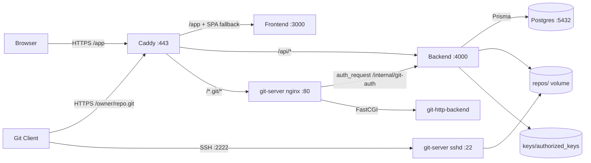

# Custom Git Server — Fullstack Monorepo Guide

This repository hosts a self-contained Git platform with:

- Web app for account, SSH key, PAT, and repository management
- API for auth and Git authorization checks
- Git transport over HTTPS and SSH
- Local TLS and service routing via Caddy

## Fullstack Architecture



## Service Roles

- Caddy: TLS termination, edge routing, HTTPS redirect
- Frontend: React SPA served behind Caddy
- Backend: Fastify API, auth/session/token/repository management, internal Git auth check
- git-server: nginx + fcgiwrap + git-http-backend for Smart HTTP, sshd for SSH Git
- Postgres: persistence for users, keys, PATs, repos, refresh tokens

## Repository Layout

```text
.
├── apps/
│   ├── backend/        # Fastify API + Prisma + tests
│   └── frontend/       # Vite/React SPA + tests
├── infra/git-server/   # git-server image and nginx configs
├── docs/               # design and task docs
├── keys/               # bind-mounted authorized_keys (gitignored)
├── repos/              # bind-mounted bare repositories (gitignored)
├── Caddyfile
├── docker-compose.yml
├── docker-compose.dev.yml
├── package.json
└── pnpm-workspace.yaml
```

## Prerequisites

- Docker and Docker Compose
- Node.js 20+
- pnpm

## Startup Guide

1. Install dependencies from repository root.

```bash
pnpm install
```

2. Create local environment file.

```bash
cp .env.example .env
```

3. Start the full stack.

```bash
docker compose up -d --build
```

4. Verify services.

```bash
docker compose ps
docker compose logs -f backend frontend git-server caddy
```

5. Open the app and proceed with first-run workflow.

- UI: `https://localhost/app`
- API: `https://localhost/api/*`
- Git HTTPS: `https://localhost/<owner>/<repo>.git`
- Git SSH: `ssh://git@localhost:2222/git-repos/<owner>/<repo>.git`

If local trust for Caddy's internal CA is not configured yet, TLS warnings are expected.

## Developer Workflows

Fast watch mode for app development:

```bash
pnpm dev
```

Compose dev profile with hot-reload mounts:

```bash
pnpm dev:stack
```

Equivalent compose command:

```bash
docker compose -f docker-compose.yml -f docker-compose.dev.yml --profile dev up --build
```

Workspace quality checks:

```bash
pnpm lint
pnpm test
pnpm build
pnpm typecheck
```

## User Workflow

1. Register an account and log in via the UI.
2. Add an SSH public key in the SSH Keys page.
3. Create a Personal Access Token in the Tokens page (shown once).
4. Create a repository from the dashboard.
5. Clone over HTTPS with username and PAT.

```bash
git clone https://<username>:<pat>@localhost/<owner>/<repo>.git
```

6. Or clone over SSH after key upload.

```bash
git clone ssh://git@localhost:2222/git-repos/<owner>/<repo>.git
```

7. Push commits normally with the selected transport.

## Stop / Reset

Stop services and keep data:

```bash
docker compose down
```

Stop and remove volumes (destructive):

```bash
docker compose down -v
```

## Testing

Backend:

```bash
pnpm --filter @custom-git-server/backend test
pnpm --filter @custom-git-server/backend typecheck
```

Frontend:

```bash
pnpm --filter @custom-git-server/frontend test
pnpm --filter @custom-git-server/frontend test:cov
pnpm --filter @custom-git-server/frontend test:e2e
```

Whole workspace:

```bash
pnpm build
pnpm test
pnpm lint
pnpm typecheck
```

## Important Notes

- `/internal/*` backend routes are internal-only and must not be exposed at the edge.
- Keep secrets out of source code; use environment variables in `.env`.
- Use [tasks-fullstack.md](tasks-fullstack.md) as the canonical implementation checklist.

## Related Documentation

- [design-fullstack.md](design-fullstack.md)
- [tasks-fullstack.md](tasks-fullstack.md)
- [design-http-auth-https.md](design-http-auth-https.md)
- [tasks-http-auth-https.md](tasks-http-auth-https.md)
